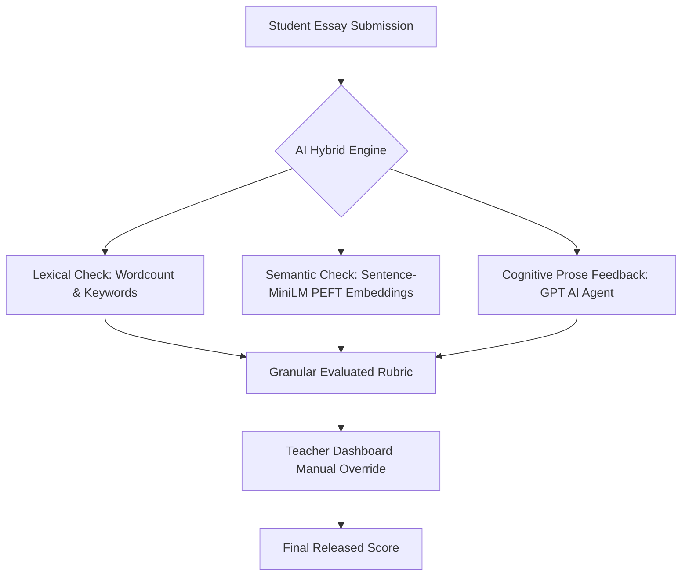

# 🎓 GradifyAI — Premium AI-Powered Academic Evaluation & Classroom Intelligence

[](https://www.gradifyai.online)
[](https://react.dev)
[](https://vitejs.dev)
[](https://tailwindcss.com)

GradifyAI is a state-of-the-art, AI-driven academic automation and grading platform designed to streamline classroom collaboration, semantic essay grading, and detailed student progress tracking. Built using **React + Vite** for blazing-fast client-side execution, GradifyAI combines a premium glassmorphic user interface with fine-tuned NLP pipelines, offering educators and students a seamless digital workspace.

---

## 📖 Table of Contents
1. [🧩 The Problem & The Solution](#-the-problem--the-solution)
2. [🌟 Key Features](#-key-features)
   - [For Teachers / Instructors](#for-teachers--instructors)
   - [For Students](#for-students)
3. [🤖 Hybrid AI/ML Grading Engine](#-hybrid-aiml-grading-engine)
4. [🎨 Custom UI Architecture & Layout Highlights](#-custom-ui-architecture--layout-highlights)
5. [🛠️ Technical Stack](#%EF%B8%8F-technical-stack)
6. [📂 Workspace Directory Structure](#-workspace-directory-structure)
7. [🚀 Getting Started & Local Setup](#-getting-started--local-setup)
8. [📈 Production Build & Optimizations](#-production-build--optimizations)
9. [📜 Future Roadmap & License](#-future-roadmap--license)

---

## 🧩 The Problem & The Solution

### ❌ The Problem
Traditional assignment grading is slow, highly subjective, and difficult to manage at scale. Teachers spend hours reading essays, checking keyword lists, and computing statistics, leaving them with less time to focus on student mentorship. Meanwhile, students receive delayed, generic feedback without understanding how their essays can be improved.

###  The GradifyAI Solution
GradifyAI automates semantic grading by utilizing a robust **hybrid AI grading engine**. It evaluates student papers on exact vocabulary checkpoints, minimum word counts, and deeper conceptual meanings using fine-tuned transformer networks (DistilBERT / Sentence-MiniLM with PEFT). 

Instructors define class rubrics, monitor real-time student curves on elegant dashboards, and retain full manual grade-override authority.

---

## 🌟 Key Features

### For Teachers / Instructors
* **🏛️ Classroom Orchestrator**: Create digital classrooms and generate instant join codes for student self-enrollment.
* **✍️ Smart Rubric Creator**: Build assignments by configuring semantic scoring targets:
  * Mandatory vocabulary keywords (comma-separated lexical checkpoints).
  * Strict minimum word counts and maximum point scales.
  * PDF/Docx reference attachments to supply grading keys.
* **📊 Analytics Dashboard**: Renders real-time statistics:
  * **Grade Distribution Curves**: Live graphical classifications grouped across:
    * **A** (80-100) | **B** (65-79) | **C** (51-64) | **D** (41-49) | **F** (<40)
  * Class average scores, active class rosters, and total submission tallies.
* **📋 Student Roster Management**: Review enrolled profiles and dismiss students with zero hassle.

### For Students
* **🔑 Quick Join System**: Enter classroom join codes to instantly participate in courses.
* **🎯 Dynamic Homework Timelines**: Monitor active homework requirements, deadlines, and submission states.
* **📤 Rich Submissions Portal**: Securely upload PDF, DOCX, or raw essay formats with visual success checkmarks.
* **💬 AI Feedback Hub**: Review a granular score breakdown (semantic scores, keyword hits, wordcount validation) alongside detailed, automated AI recommendations.

---

## 🤖 Hybrid AI/ML Grading Engine

GradifyAI implements a **three-tiered grading framework**:



1. **Sentence-MiniLM (PEFT)**: Calculates semantic cosine similarities between student essays and the teacher's reference guidelines to verify core understanding rather than simple keyword matching.
2. **Lexical Keyword Scanner**: Performs exact-match index scans to verify the inclusion of required terminology defined by the course syllabus.
3. **Automated AI Agent**: Evaluates grammatical structure and prose strength, delivering constructive, individualized critique blocks for students.

---

## 🎨 Custom UI Architecture & Layout Highlights

GradifyAI sets a new standard for modern educational software aesthetics:
* **Glassmorphic Theme System**: Elegant translucent components, soft radial HSL color gradients, subtle border boundaries, and custom-styled webkit scrollbars.
* **React Portals (`createPortal`)**: Modals (like Create Classroom and Create Assignment) bypass parent layout components completely. By rendering at `document.body` level:
  * Modals are immune to CSS `transform` or `filter` bounds in parent wrappers.
  * Backdrops apply complete, uninterrupted blur overlay (`backdrop-blur-[3px] bg-slate-900/25`) across sidebars and top headers.
* **Vertical Scroll-Safety Overlay**: Prevents tall inputs (e.g. assignment parameters) from being clipped on small laptop displays or mobile screens by starting alignment from `items-start` with responsive vertical margins (`my-8 sm:my-12`).

---

## 🛠️ Technical Stack

* **Frontend**: React 18+, Vite, ES6 Javascript, Tailwind CSS, Lucide Icons
* **Routing & State**: React Router DOM, React Context hooks
* **AI/ML Layer**: Sentence-Transformers, Fine-tuned PEFT Embeddings, OpenAI GPT Engine APIs
* **Networking**: Bearer Token Authorization, Fetch APIs with FormData file upload hooks
* **PWA Engine**: Service workers (`sw.js`) and precached asset manifest files for seamless offline capabilities.

---

## 📂 Workspace Directory Structure

```text
gradifyai/
├── src/
│   ├── components/
│   │   ├── ui/
│   │   │   ├── Modal.jsx        # Premium React Portal modal wrapper
│   │   │   └── Toast.jsx        # Beautiful feedback notifier
│   │   ├── AssignmentForm.jsx   # Clean grading parameters creator
│   │   └── SideBar.jsx          # Collapsible navigation drawer
│   ├── pages/
│   │   ├── Base.jsx             # Main dashboard navigation layout
│   │   ├── Teacher.jsx          # Teacher classrooms summary & stats
│   │   ├── ClassRoom.jsx        # Enrolled student roster & assignments
│   │   ├── Student.jsx          # Student homework dashboard
│   │   └── AssignmentDetails.jsx# Submissions portal & AI grading feedback
│   ├── context/
│   │   └── AuthContext.jsx      # Global session & token manager
│   ├── index.css                # Premium design system global HSL tokens
│   └── App.jsx                  # Main routing gateway
├── tailwind.config.js           # Custom theme colors and transitions config
├── vite.config.js               # Optimized Vite asset builds pipeline
└── README.md                    # Rich repository documentation
```

---

## 🚀 Getting Started & Local Setup

Spin up the local client application under 2 minutes:

### 1. Prerequisites
Verify that [Node.js](https://nodejs.org/) (v18.0.0+) and [NPM](https://www.npmjs.com/) are installed on your terminal.

### 2. Installation
```bash
# Clone the repository
git clone https://github.com/RanaUmairPy/gradifyai.git

# Enter workspace folder
cd gradifyai

# Install node dependencies
npm install
```

### 3. Running in Development
```bash
# Launch server with Hot Module Replacement (HMR)
npm run dev
```
Open [http://localhost:5173](http://localhost:5173) inside your browser.

---

## 📈 Production Build & Optimizations

Before pushing to GitHub Pages or Vercel, build the high-performance bundle:

```bash
# Run production build compilation
npm run build
```
Vite will bundle all React modules, purge unused Tailwind CSS guidelines, and compile pre-cache manifests for PWA workers in the output folder: `dist/`.

To test the compiled assets locally:
```bash
# Run local preview of compiled bundle
npm run preview
```

---

## 📜 Future Roadmap & License

*  **Plagiarism Radar**: Auto-check similarity metrics between all enrolled student submissions to detect academic collusion.
*  **Dynamic Audio Critiques**: AI agents generate vocal feedback clips to assist auditory learners.
*  **Instant LMS Syncing**: Direct export adapters for Canvas LMS, Google Classroom, and Moodle.

Developed by Rana Umair and the GradifyAI Engineering Team. Released under the **MIT License**.
